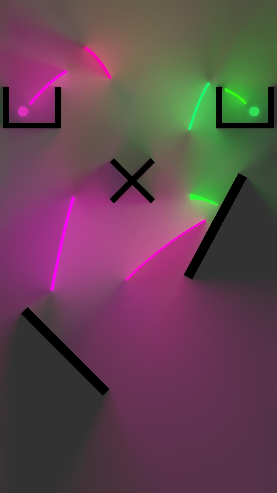

# Radiance Cascades

Real-time 2D global illumination through radiance cascades. Built with the Unity SRP Render Graph system.

## Usage

1. Add the "2D GI" renderer feature to your URP renderer
2. Use a material with the "Sprite (GI)" shader on all objects that should emit or receive global illumination.
3. Objects that emit light should have a variant of the material using the "_GI_EMISSION" keyword enabled (available as a toggle in the inspector).

## Configuration

The renderer feature has the following options to configure:

- `rayCountExponent` (default `2`): Configures the number of rays per pixel per cascade. The actual number of rays is `4^rayCountExponent`, to make sure a valid spatial subdivision can be made. This will also determine the number of cascades.
- `maxSteps` (default `32`): The amount of raymarching steps. The default should be sufficient to reach the end of the screen, unless you have a lot of high frequency details.
- `bilinearSampling` (default `true`);

## Acknowledgements 

Made possible by [Jason McGhee's excellent write-up](https://jason.today/rc) and the [original radiance cascades paper](https://github.com/Raikiri/RadianceCascadesPaper).